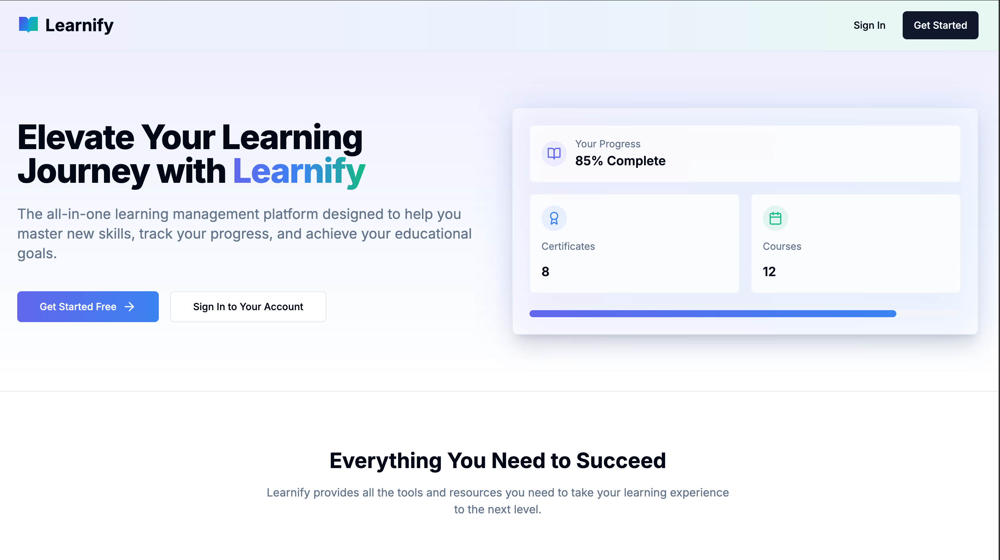
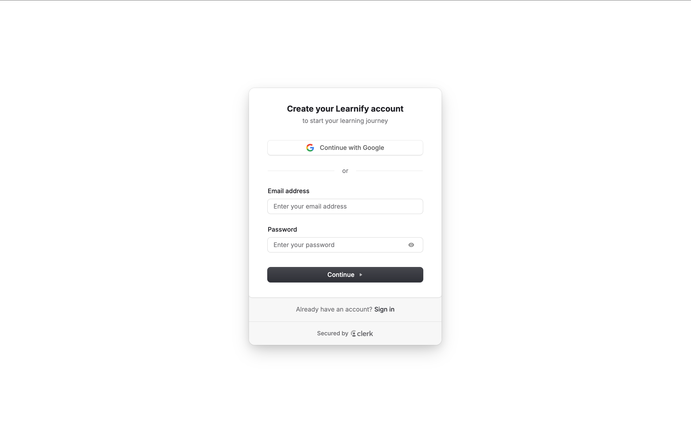
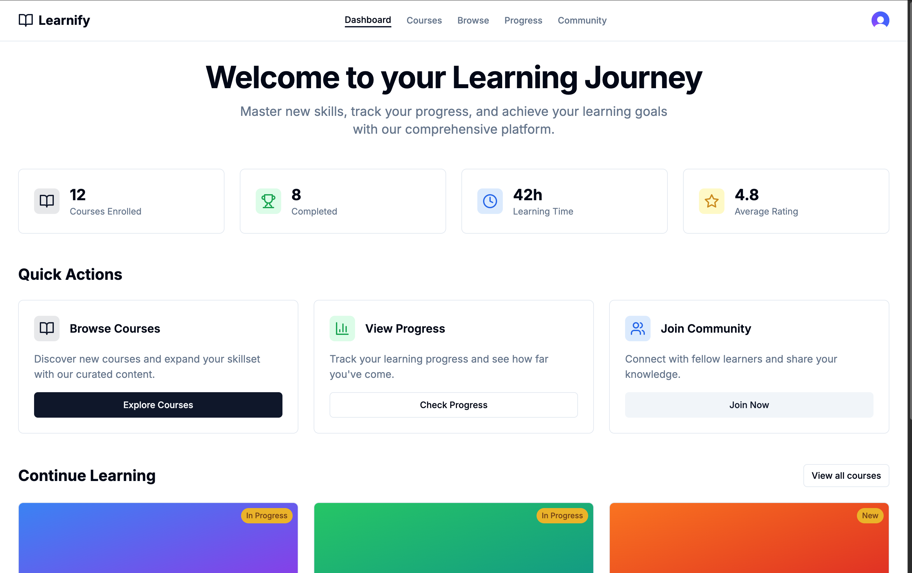
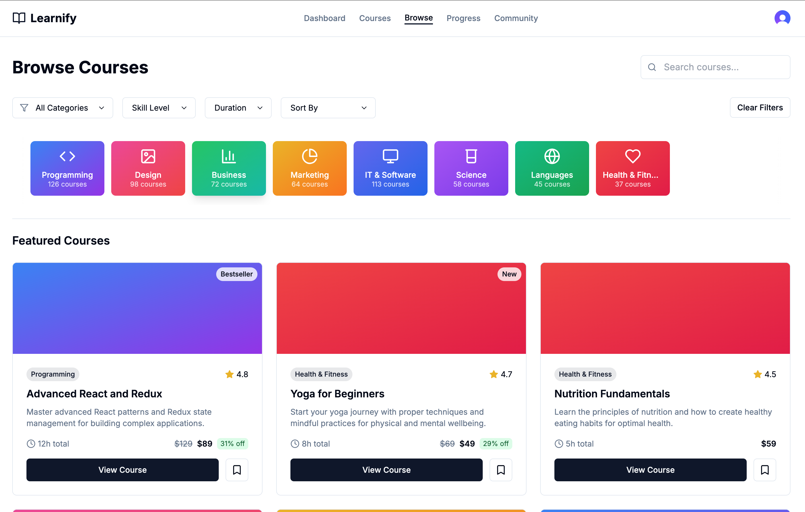
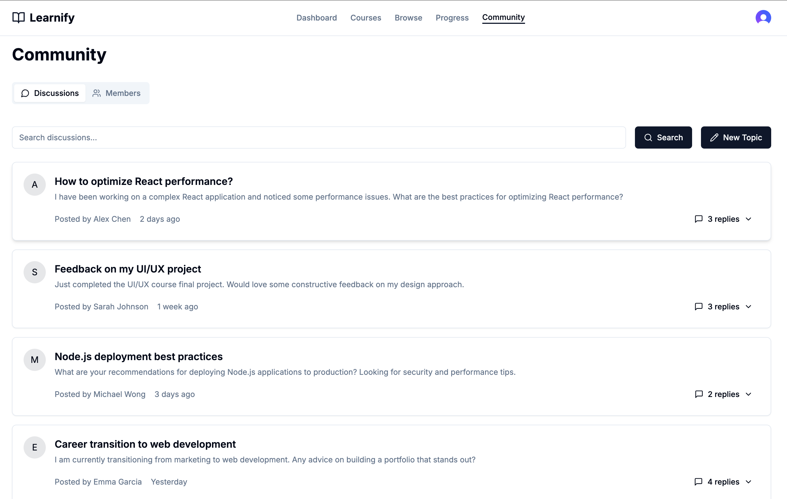
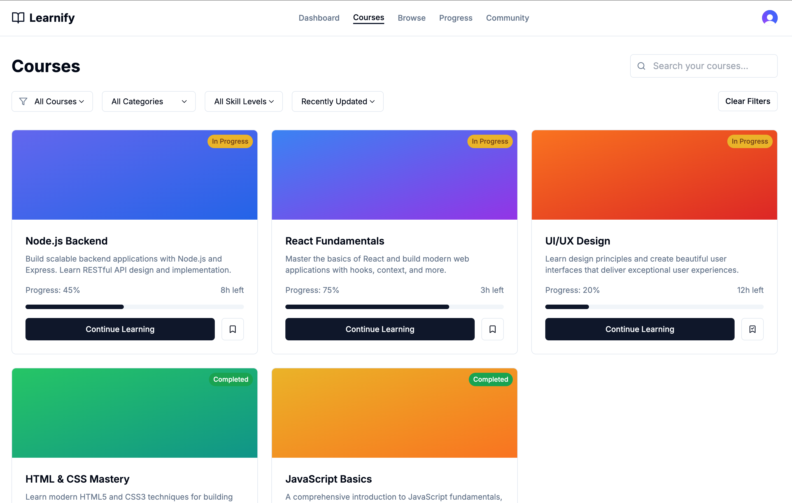
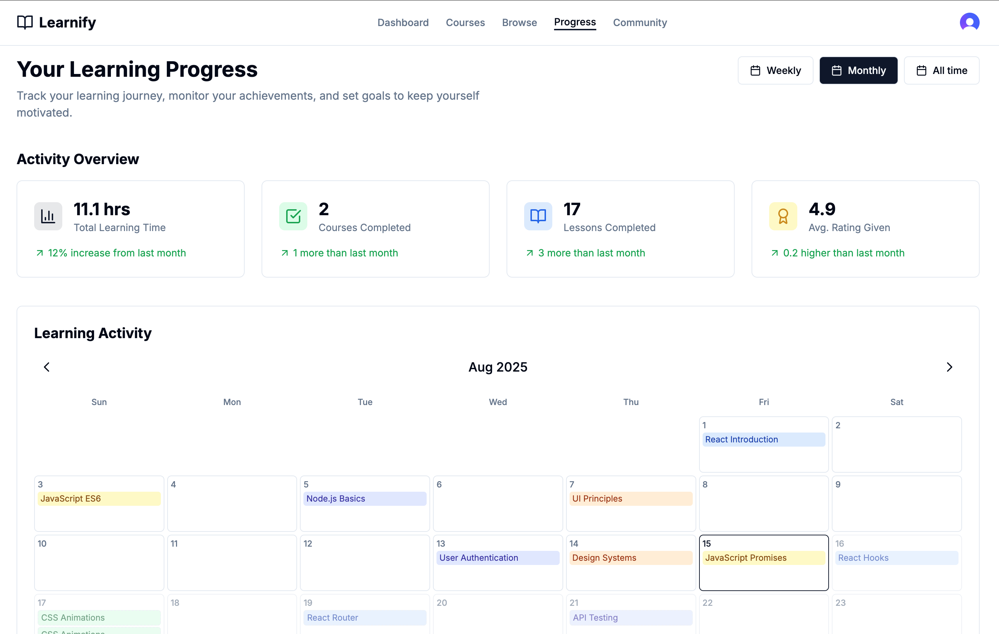

# Afridu

Afridu is my student Learning Management System (LMS) project.

The goal of this project is to build a clean and practical platform where learners can browse courses, track progress, and stay consistent with their learning goals.

## Live Project

- App link: [https://afridu-new-1.vercel.app/dashboard](https://afridu-new-1.vercel.app/dashboard)

## About This Project

I built Afridu to practice full-stack web development with a real product idea. While building it, I focused on:

- Authentication and route protection
- Reusable UI components
- Dynamic routing in Next.js
- Progress tracking logic
- Organizing code in a scalable folder structure

## Main Features

- User authentication (email/password and social login through Clerk)
- Protected dashboard pages
- Browse and explore available courses
- Course details pages with dynamic routes
- Progress tracking section
- Community page for learner interaction
- Responsive design for desktop and mobile

## Pages

### Landing Page
<div align="center">
  
</div>

### Sign-Up Page
<div align="center">
  
</div>

### Dashboard
<div align="center">
  
</div>

### Browse Courses
<div align="center">
  
</div>

### Community Page
<div align="center">
  
</div>

### Courses Page
<div align="center">
  
</div>

### Progress Page
<div align="center">
  
</div>

## Tech Stack

- Next.js 14
- TypeScript
- React
- Tailwind CSS
- Clerk (Auth)
- Node.js
- Vercel (Deployment)

## Project Setup

1. Clone the repo:
   ```bash
   git clone https://github.com/kamalafidele/afridu-app.git
   cd lms-framework
   ```

2. Install dependencies:
   ```bash
   npm install
   ```

3. Create your environment file:
   ```bash
   cp .env.example .env.local
   ```

4. Add your keys in `.env.local`:
   - Clerk publishable key
   - Clerk secret key
   - Any other required variables

5. Start the app:
   ```bash
   npm run dev
   ```

6. Open:
   - [http://localhost:3000](http://localhost:3000)

## What I Learned

- How to structure a Next.js App Router project
- How middleware helps protect private routes
- How to design reusable UI components
- How to deploy and test quickly on Vercel

## Future Improvements

- Add quizzes and assignments per course
- Add instructor dashboard and analytics
- Add better filtering and search for courses
- Add notifications and reminders

## Deployment

This project is deployed on Vercel:

- [https://afridu-new-1.vercel.app/dashboard](https://afridu-new-1.vercel.app/dashboard)

## License

MIT License
